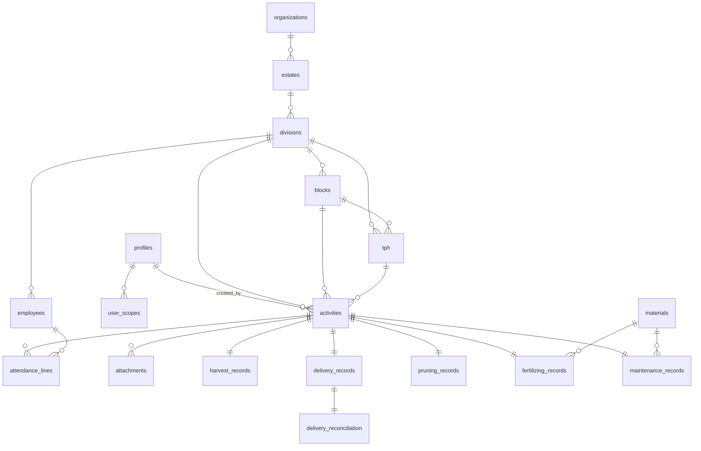

# Desain Database & RLS — Monitoring Agro

Dokumen ini menjelaskan skema database (Supabase/PostgreSQL), Row Level Security (RLS), dan integrasi offline-first PowerSync untuk aplikasi Monitoring Agro. Mengacu pada **PRD v0.2** (scope MVP: Panen + Pengiriman, multi-estate, PowerSync, pencatatan oleh mandor).

> **Status penerapan:** ✅ Sudah diterapkan ke project Supabase **CGA** (`mgxdvnnvruoyhnzgrtur`) pada schema khusus **`agro`** (terisolasi dari schema `public` aplikasi lain). Migration 001–011 berhasil; security advisor bersih untuk schema agro (RLS aktif di semua tabel).
>
> **Semua objek ada di schema `agro`.** Tabel, fungsi helper, dan view memakai prefix `agro.`. Trigger di `auth.users` dinamai unik (`agro_on_auth_user_created`) agar tidak menimpa milik aplikasi lain di CGA.

## 1. Urutan File Migration

Jalankan berurutan (tiap file = 1 migration, idempoten/aman diulang):

| # | File | Isi |
|---|---|---|
| 001 | `001_extensions_and_enums.sql` | Extension, schema `app`, enum, util `set_updated_at` |
| 002 | `002_org_hierarchy.sql` | organizations → estates → divisions → blocks → tph |
| 003 | `003_people_and_rbac.sql` | profiles, user_scopes, employees, auto-create profil |
| 004 | `004_activities_core.sql` | activities, attendance_lines, attachments, audit_logs |
| 005 | `005_modules_mvp.sql` | **Panen, Pengiriman, Rekonsiliasi** (Fase 1) |
| 006 | `006_modules_phase2.sql` | materials, prunning, pemupukan, pemeliharaan (Fase 2) |
| 007 | `007_rls_helpers.sql` | Fungsi helper RLS (SECURITY DEFINER) |
| 008 | `008_rls_policies.sql` | Aktifkan RLS + semua policy |
| 009 | `009_business_triggers.sql` | Penjaga role, stempel verifikasi, audit status |
| 010 | `010_sync_support_views.sql` | View pendukung sinkron PowerSync |
| 016 | `016_storage_attachments.sql` | Bucket Storage `attachments` + policy foto (per-divisi) |
| 017 | `017_fertilizing_plans.sql` | Rencana pemupukan per divisi/material/bulan (web-only) |
| 018 | `018_scheduled_reports.sql` | Laporan terjadwal: tabel + fungsi + **pg_cron** harian |
| 019 | `019_report_email.sql` | Kolom penerima email & penanda kirim (Resend) |
| 020 | `020_auto_email.sql` | **Auto-email** setelah cron: pg_net + app_config (cron_secret) |
| — | `powersync_sync_rules.yaml` | Dipasang di **PowerSync Dashboard**, bukan Postgres |
| — | `functions/agro-email-report/` | Edge Function kirim laporan via **Resend** (set `RESEND_API_KEY`) |
| — | `functions/agro-create-user/` | Edge Function buat akun pengguna: password sementara, atau **undangan email** (`invite`) via Supabase Auth + tautan ke `/set-password` |

> **Undangan email**: mode `invite` memakai **`inviteUserByEmail`** — Supabase Auth sendiri yang
> mengirim email undangan (template "Invite user", lewat email bawaan Auth / SMTP kustom). **Tidak butuh
> Resend maupun verifikasi domain**; bisa kirim ke email apa pun (email bawaan Supabase punya rate-limit
> rendah, untuk produksi set **Custom SMTP** di Auth → Emails). Tautan `redirect_to` ke `${origin}/set-password`;
> agar tautan kembali ke app, tambahkan URL itu di **Auth → URL Configuration → Redirect URLs**.
> Diverifikasi 2026-06-12: log Auth `mail.send` (mail_type=invite) terkirim ke email asli.

> **Auto-email**: `run_scheduled_reports()` (pg_cron harian) membuat laporan lalu, bila
> jadwal punya `email_recipients`, memanggil Edge Function via `pg_net` (header
> `x-cron-secret` dari `agro.app_config`, RLS deny-all). Edge Function pakai mode
> service untuk cron, atau token pemanggil (RLS admin) untuk tombol di dashboard.
> Aktif setelah secret `RESEND_API_KEY` di-set di Supabase.

> Catatan: migration 011–015 (perbaikan & publication PowerSync) sudah
> diterapkan; 013 (role PowerSync berpassword) ada di `powersync/role.sql`
> dan dijalankan manual. Migration 016 mengatur Storage foto `attachments`
> (path objek `{division_id}/{activity_id}/{file}`; akses dibatasi per divisi).

## 2. Diagram Relasi (ERD)

**Pola inti:** `activities` adalah tabel induk semua kegiatan. Detail spesifik per jenis kegiatan ada di tabel 1:1 (`harvest_records`, `delivery_records`, dst). Output per karyawan (mis. janjang panen) dicatat di `attendance_lines`. Kolom `organization_id`/`estate_id`/`division_id` didenormalisasi ke tabel turunan agar RLS dan sync rules cepat.

## 3. Model Peran & Akses (RBAC)

Peran disimpan di `profiles.role`; cakupan akses di `user_scopes` (bisa lebih dari satu — mendukung manager multi-estate).

| Peran | Cakupan (scope) | Hak utama |
|---|---|---|
| `super_admin` | semua | Konfigurasi sistem, kelola user/role, audit |
| `admin_grup` | semua estate | Master data lintas estate, kelola user, audit |
| `manager_kebun` | estate (1+) | Lihat seluruh divisi di estate-nya; kelola blok/tph/karyawan; verifikasi |
| `asisten` | divisi (1+) | Input & verifikasi laporan divisinya |
| `mandor` | divisi (1+) | Input laporan divisinya |

**Akses lintas estate hanya untuk `manager_kebun` (dalam estate-nya) & admin** — sesuai keputusan PRD. Karyawan **tidak login** (objek pencatatan saja).

### Cara memberi akses ke seorang pengguna
1. User mendaftar (Supabase Auth) → profil otomatis dibuat dengan role `mandor`.
2. Admin set role yang benar di `profiles`.
3. Admin tambah baris `user_scopes` (mis. `scope_type='division', scope_id=<uuid divisi>`).

## 4. Pendekatan RLS (anti-rekursi)

Semua keputusan akses memakai fungsi helper di schema `agro` yang **SECURITY DEFINER** sehingga membaca `profiles`/`user_scopes` tanpa memicu RLS (mencegah rekursi kebijakan). Fungsi kunci: `agro.is_admin()`, `agro.can_input()`, `agro.can_verify()`, `agro.has_estate_access()`, `agro.has_division_access()`, dan helper turunan `agro.activity_readable()` / `agro.activity_editable_by_owner()` / `agro.activity_verifiable()`.

Ringkas aturan `activities`:
- **SELECT**: punya akses ke divisinya.
- **INSERT**: mandor/asisten, punya akses divisi, `created_by = auth.uid()`.
- **UPDATE**: pemilik saat status `draft`/`rejected`, ATAU verifikator (asisten/manager) yang punya akses.
- **DELETE**: pemilik (draft/rejected) atau admin. (Disarankan pakai soft-delete `deleted_at`.)

Status laporan: `draft → submitted → approved/rejected`. Setelah `approved`, laporan **terkunci dari mobile** (tidak masuk syarat edit pemilik).

## 5. Offline-First & PowerSync

- **PK `id` (uuid)** bisa dibuat di klien saat offline → tanpa round-trip server.
- **`client_uuid`** menjamin idempotensi (tidak dobel) saat retry sinkron.
- **`updated_at`** dipakai PowerSync untuk konflik (default *last-write-wins* per baris).
- **Arah baca (server→device):** diatur `powersync_sync_rules.yaml` — master data per **estate**, kegiatan per **divisi**, sehingga device hanya menyimpan data relevan (hemat ruang/baterai).
- **Arah tulis (device→server):** upload melewati Supabase client → **RLS** (file 008) yang memutuskan boleh/tidaknya.
- `delivery_reconciliation` & `audit_logs` **tidak** disinkron ke mobile (khusus dashboard web).

> **Setup PowerSync:** buat role Postgres khusus PowerSync dengan atribut `REPLICATION` dan `BYPASSRLS`, lalu pasang sync rules di PowerSync Dashboard. Ikuti panduan resmi integrasi PowerSync–Supabase.

## 6. Status Penerapan & Langkah Lanjutan

**Sudah dijalankan ke CGA** (schema `agro`), migration 001–011. Yang **masih perlu Anda lakukan** agar aplikasi bisa pakai schema ini:

1. **Expose schema `agro` ke API** — di Supabase Dashboard: *Settings → API → Exposed schemas*, tambahkan `agro`. (Tidak bisa lewat SQL/MCP, harus dari dashboard.)
2. **Akses dari klien** — Supabase JS pakai `supabase.schema('agro').from('activities')...`, atau set `db: { schema: 'agro' }` saat `createClient`.
3. **PowerSync** — buat role Postgres khusus (`REPLICATION` + `BYPASSRLS`), tambahkan tabel schema `agro` ke publication, lalu pasang `powersync_sync_rules.yaml` di PowerSync Dashboard.

> Untuk menjalankan ulang/menerapkan ke project lain: salin file `001`→`011` (011 = perbaikan minor `search_path`) ke SQL Editor berurutan.

## 7. Checklist Verifikasi
- [x] Semua tabel, enum, fungsi, view, trigger terbuat di schema `agro`.
- [x] RLS aktif di semua tabel; security advisor bersih untuk `agro`.
- [ ] Expose schema `agro` di Settings → API (manual).
- [ ] Buat 1 user uji per peran, set scope, pastikan hanya melihat data yang berhak.
- [ ] Mandor TIDAK bisa melihat divisi lain / estate lain.
- [ ] Laporan `approved` tidak bisa diedit dari akun mandor.
- [ ] Uji insert offline (uuid dari klien) lalu sinkron — tidak dobel.

## 8. Catatan & Item Terbuka
- Verifikasi otomatis SQL di sandbox **belum** dijalankan (workspace tidak tersedia saat penyusunan). Perlu dijalankan di SQL Editor / staging sebelum produksi.
- Belum ada Storage bucket & policy untuk foto (`attachments.storage_path`) — akan dibuat saat modul foto.
- Belum ada seed/master data contoh — bisa dibuat terpisah bila perlu untuk demo.
- Aturan transisi status detail (mis. siapa boleh `submitted`→`approved`) ditegakkan di level aplikasi/edge function; RLS hanya menjaga batas kasar.
